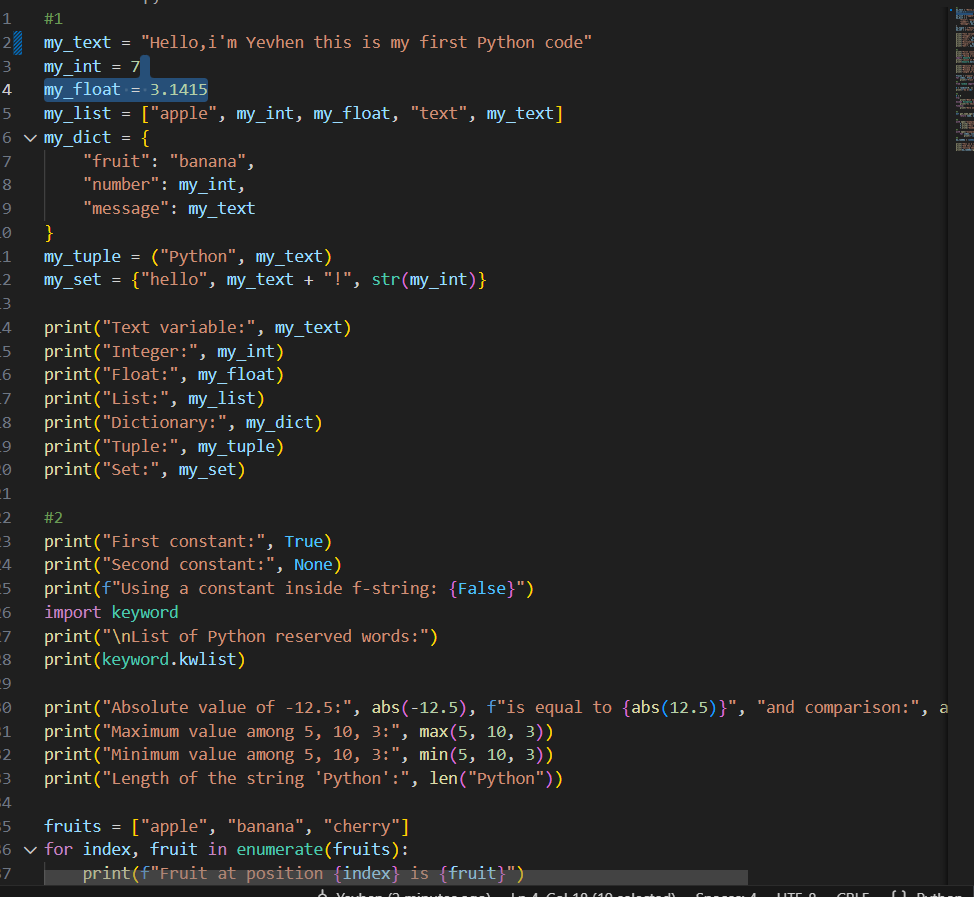

# Звіт до роботи
## Тема: Вступні заняття:Основи програмування на Python
### Мета роботи: Навчитись застосовувати основні конструкції мови Python, виконати всі приклади та з використанням AI створити власні приклади які демонструють особливості кодових конструкцій Pyhton


---
### Виконання роботи
* Результати виконання завдання *2*;
    1. Розробили/Створили першу програму на Python
    1. Програма вивела значення: "Всі значення заданого коду"
    1. Отримав наступні результати: Програма працює правильно,код спрацював у всіх методах виклику:<<Terminal,bash,jupyter>> файл з розширенням <<ipynb>> вивів результат.
    1. Навчився налаштуванню середовища роботи VS Code та створювати репозиторії в Github
* вставлені рисунки


    
    

* вставлений код / текстовий або числовий результат / інші результати:
    - my_text = "Hello,i'm Yevhen this is my first Python code"
my_int = 7
my_float = 3.1415
my_list = ["apple", my_int, my_float, "text", my_text]
my_dict = {
    "fruit": "banana",
    "number": my_int,
    "message": my_text
}

* результати виконання індивідуального завдання (якщо такі є);

---

### Перша програма штучного інтелекту (ChatGPT)

> Запитання:  Запитайте у АІ як би він розписав про основи Python (задайте промпт вказавши що ви вивчаєте Python з використанням Jupyter Notebook). Спробуйте виконати приклади Python коду та вставте їх відповіді у звіт

### Відповідь ChatGPT: Яку першу програму міг би написати ШІ та пояснення до неї

# ChatGPT Response: Basics of Python

I asked ChatGPT: *"How would you explain the basics of Python if I am learning it using Jupyter Notebook?"*

ChatGPT answered as follows:

---

## 1. Variables and Data Types

Python has different types of variables, including strings, integers, floats, lists, dictionaries, tuples, and sets. Here are some examples:

```python
my_string = "Hello, Python!"
my_int = 10
my_float = 3.14
my_list = [1, 2, 3, "four"]
my_dict = {"name": "Alice", "age": 25}
my_tuple = (1, "two")
my_set = {"apple", "banana", "cherry"}

print(my_string)
print(my_int, my_float)
print(my_list)
print(my_dict)
print(my_tuple)
print(my_set)
```
### Output:Hello, Python!
```
10 3.14
[1, 2, 3, 'four']
{'name': 'Alice', 'age': 25}
(1, 'two')
{'banana', 'apple', 'cherry'}
```
### controll structures:
```
x = 5
if x > 0:
    print("x is positive")
else:
    print("x is non-positive")

for i in range(3):
    print(f"For loop iteration: {i}")

counter = 0
while counter < 3:
    print(f"While loop counter: {counter}")
    counter += 1
    x is positive
For loop iteration: 0
For loop iteration: 1
For loop iteration: 2
While loop counter: 0
While loop counter: 1
While loop counter: 2

```
### Functions and Lambda
```
def greet(name):
    return f"Hello, {name}!"

my_lambda = lambda x: x ** 2

print(greet("Artem"))
print("Square of 5 using lambda:", my_lambda(5))
results:Hello, Artem!
Square of 5 using lambda: 25

```
### Context Managers (with statement)
```
with open("demo.txt", "w") as f:
    f.write("This is a demo file\n")

with open("demo.txt", "r") as f:
    for line in f:
        print(line.strip())
results:This is a demo file

```
### Висновок:
# Висновок до роботи

**Тема:** Основи програмування на Python  
**Мета роботи:** Навчитись застосовувати основні конструкції мови Python, виконати всі приклади та з використанням AI створити власні приклади, які демонструють особливості кодових конструкцій Python.

---

### 1. Що зроблено в роботі
У ході роботи було вивчено та опрацьовано основи Python, включаючи:  
- змінні та типи даних (str, int, float, list, dict, tuple, set);  
- управління потоком виконання (if-else, for, while);  
- функції та лямбда-функції;  
- обробку виключень (try-except-finally);  
- контекстні менеджери (`with`).  

Всі приклади були виконані у Jupyter Notebook. Додатково я звертався до ChatGPT, щоб отримати приклади коду та пояснення для кожної теми, які потім було реалізовано у власних прикладах.

---

### 2. Чи досягнуто мети роботи
Мета роботи була повністю досягнута. Було не лише виконано усі приклади, а й створено власні приклади за допомогою ChatGPT, що дозволило глибше зрозуміти особливості Python.

---

### 3. Які нові знання отримано
- Ознайомлення з базовими типами даних та їх використанням;  
- Вправи з циклів та умовних конструкцій;  
- Практика створення функцій та лямбда-функцій;  
- Розуміння роботи обробки виключень та контекстних менеджерів;  
- Досвід інтеграції AI (ChatGPT) для отримання підказок і генерації прикладів.

---

### 4. Чи вдалося відповісти на всі питання задані в ході роботи
Так, усі питання щодо основ Python були опрацьовані і перевірені на практиці.

---

### 5. Чи вдалося виконати всі завдання
Так, всі завдання виконані повністю, включаючи запуск кодів, створення власних прикладів та їх оформлення у Jupyter Notebook.

---

### 6. Чи виникли складності у виконанні завдання
Невеликі труднощі виникли при роботі з контекстними менеджерами і встановленням додаткових бібліотек у Jupyter Notebook, але вони були швидко усунені.

---

### 7. Чи подобається такий формат здачі роботи
Так, формат з Jupyter Notebook є зручним і наочним. Він дозволяє поєднувати код, результати виконання та пояснення в одному інтерактивному документі.

---

### 8. Побажання для покращення
Було б корисно додати більше прикладів для складніших конструкцій Python, а також поради щодо оформлення звіту та інтеграції результатів виконання коду у Markdown-комірки для автоматичного відображення результатів.

