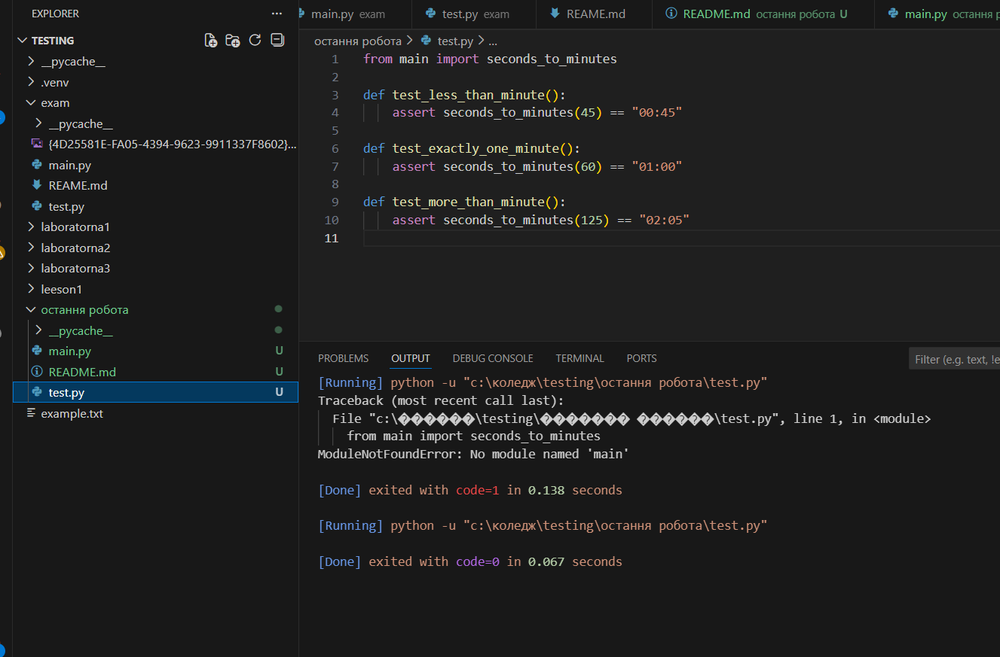

# Екзаменаційне завдання білет 25

- створити окрему папку `exam` у репозиторії з двома файлами `main.py` та `test.py`
- у файлі `main.py` створити функцію `seconds_to_minutes(seconds: int)`, яка перетворює кількість секунд у рядок формату `"mm:ss"`
- у файлі `test.py` написати Unit-тести для перевірки роботи функції:
  - значення менше однієї хвилини
  - рівно одна хвилина
  - значення більше однієї хвилини
- запустити програму у `main.py` та запустити тестування

## Приклад виконання

- запускаємо програму:
  ```bash
  python main.py

